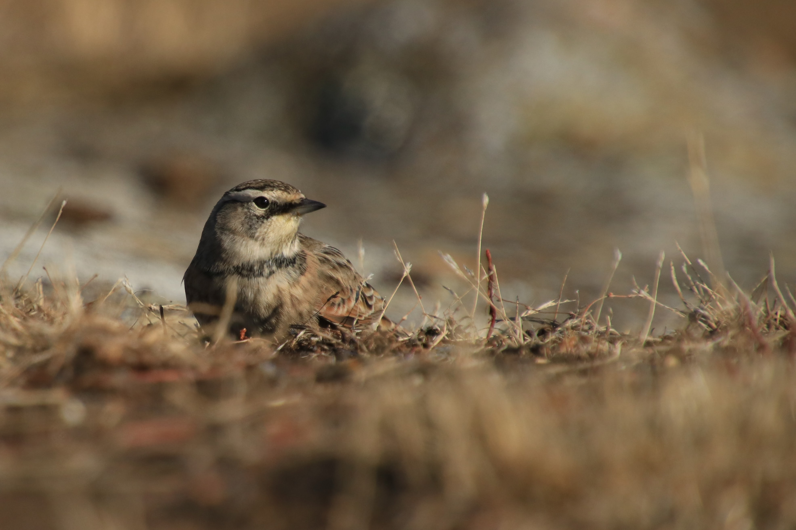
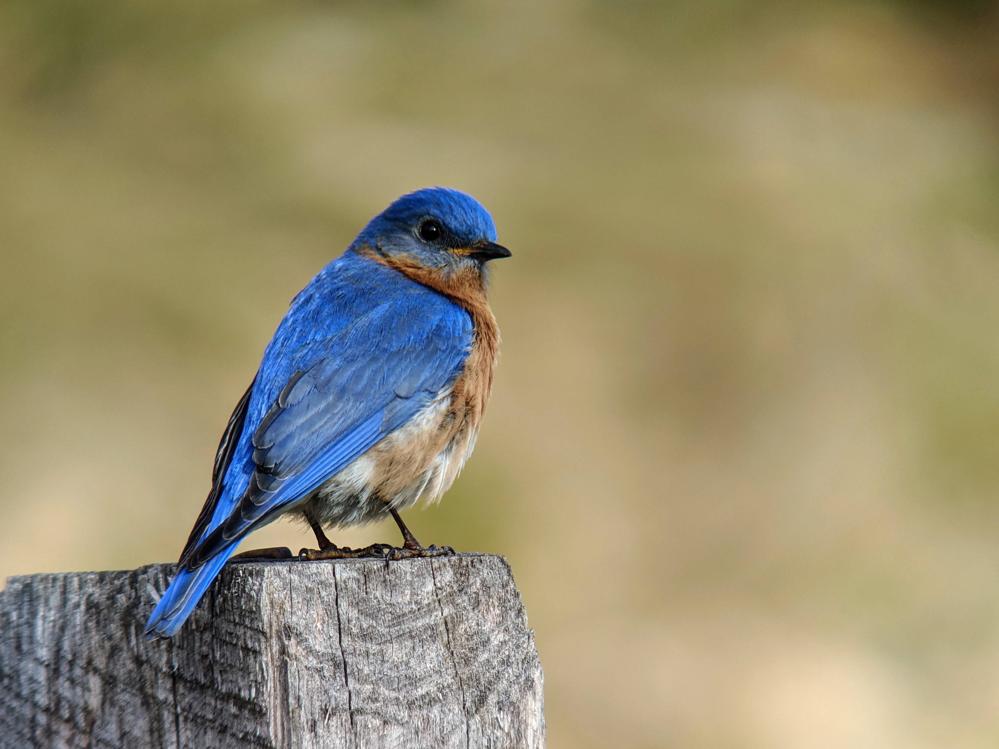

# Network Data Science

### Instructor: Ben Pedigo

_Johns Hopkins University_
_[NeuroData lab](https://neurodata.io/)_
[_@bdpedigo (Github)_](https://github.com/bdpedigo)
[_bpedigo@jhu.edu_](mailto:bpedigo@jhu.edu)

---
# About me
- PhD Candidate in [NeuroData lab](https://neurodata.io/)
- My work focuses on using statistical and computational techniques to help understand [nanoscale connectomes](https://www.nature.com/articles/d41586-019-02208-0).
- I am a lead developer of a Python package for network data science called [`graspologic`](https://github.com/microsoft/graspologic), which we co-develop with Microsoft Research.
- I did a couple of internships at Microsoft Research, working on techniques for analyzing search and communication networks. 

---
# About me

A few of my other interests are birdwatching, bouldering, and biking.

---
# About you?
- Name?
- Year?
- Major?
- Research interests? (if you have any)
- Hobbies?

---
# Goals

- Introduction to the field of network science
- Overview of techniques that are used so that students are well equipped to explore the field further
- Code/analysis product to add to portfolio

- Familiarity with `Python`
- Familiarity with `git`/`GitHub`
- Practice communicating technical content via oral and online (`jupyter-notebook`/`jupyter-book`) media

---
# Course logistics

- Course meets MTWThF, 1-2:20pm ET, on Zoom
- Last 20-30 minutes of each day will hopefully be for project work time
- I will be available ~2:20-2:45pm ET (or when everyone leaves) - think of this as extra office hours
- Syllabus: [https://bdpedigo.github.io/networks-course/syllabus.html](https://bdpedigo.github.io/networks-course/syllabus.html) (please review)
- Calendar: [https://bdpedigo.github.io/networks-course/calendar.html](https://bdpedigo.github.io/networks-course/calendar.html)
- **Everything will be on the course website** above, not going to use Blackboard for much.
- Class communication will be via **Discord**.

---
# Grading
(straight from the syllabus)
> To pass, a student must: 
> - Attend and engage with every lecture (please let the instructor know if you need to miss a lecture for some reason)
> - Submit the pre-project mini-assignment by 11:59pm on Jan 5th
> - Submit any other mini-assignments (these may be very minor things like filling out surveys, telling me what your final project will be, etc.)
> - Submit a merge-able final project notebook by 12pm (noon) on Jan 20th (Thursday)
> - Present their final project on the last day of class, Jan 21st (Friday)

---
# Mini-assignment
- Need to make a pull request to this class's repository on GitHub
- Due **Jan 5th at 11:59pm**
- **Highly encouraged** to come to class time, work with other students
- Description of the mini-assignment is [here](https://bdpedigo.github.io/networks-course/mini_assignment.html) (and on sidebar for course website).
  
---
# Final project - notebook
- The final project is a short analysis of some dataset in the form of a [Jupyter Notebook](https://jupyter.org/)
- The notebook should describe (using text and figures):
   - The dataset(s) you investigated, and what you wanted to learn from them
   - The methods you used, explained at a level that someone else in the class would definitely understand
   - The results you found, with a few figures
   - A brief discussion of the meaning of these results

---
# Final project - notebook
- You are welcome to collaborate, but 
   - Each student must submit their own notebook and write their own code. 
   - If there's something you want to collaborate more extensively on, discuss with instructor. 
   - Acknowledge any people you collaborated with in the notebook.
- Reference any articles, data sources, etc. you used in your notebook.
- **Notebooks are due Thursday, January 20th at 12pm (noon) ET.** This will give me time to address any issues with your pull requests and merge them by the time we have presentations the next day.
   - You are encouraged to submit pull requests earlier than this, and I am happy to provide feedback! 

---
# Final project - presentation
- Everyone will present their final projects **on the last day of class, January 21st.**
- Presentations should be <5 minutes (no longer than 5) with 2 minutes for questions.
- Presentation should briefly cover the same main points from the notebook. 
   - Some details from the notebook you may not have time to cover in the presentation; that's OK.

--- 
# Feedback
- I am always open to feedback (positive or negative). You can leave any comments you have here: https://forms.gle/UxFB2sSQiQyrxr5AA
- Can be totally anonymous, if you'd like.