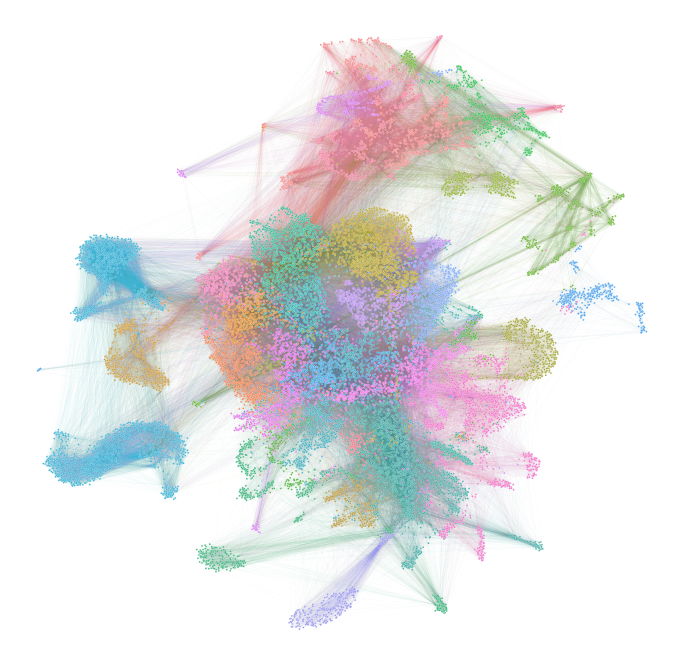

# Network Data Science

### Instructor: Ben Pedigo

_Johns Hopkins University_
_[NeuroData lab](https://neurodata.io/)_
[_@bdpedigo (Github)_](https://github.com/bdpedigo)
[_bpedigo@jhu.edu_](mailto:bpedigo@jhu.edu)

---
# About me
- PhD Candidate in [NeuroData lab](https://neurodata.io/)
- My work focuses on using statistical and computational techniques to help understand [nanoscale connectomes](https://www.nature.com/articles/d41586-019-02208-0).
- I am a lead developer of a Python package for network data science called [`graspologic`](https://github.com/microsoft/graspologic), which we co-develop with Microsoft Research.
- I did a couple of internships at Microsoft Research, working on techniques for analyzing search and communication networks. 
- A few of my other interests are birdwatching, bouldering, and biking.

---
# About you?
- Name?
- Year?
- Major?
- Research interests? (if you have any)
- Hobbies?

---
# Goals

- Introduction to the field of network science
- Overview of techniques that are used so that students are well equipped to explore the field further
- Code/analysis product to add to portfolio

- Familiarity with `Python`
- Familiarity with `git`/`GitHub`
- Practice communicating technical content via oral and online (`jupyter-notebook`/`jupyter-book`) media

---
# Course logistics

- Course meets MTWThF, 1-2:20pm ET, on Zoom
- Last 20-30 minutes of each day will hopefully be for project work time
- I will be available ~2:20-2:45pm ET (or when everyone leaves) - think of this as extra office hours
- Syllabus: [https://bdpedigo.github.io/networks-course/syllabus.html](https://bdpedigo.github.io/networks-course/syllabus.html) (please review)
- Calendar: [https://bdpedigo.github.io/networks-course/calendar.html](https://bdpedigo.github.io/networks-course/calendar.html)
- **Everything will be on the course website** above, not going to use Blackboard for much.
- Class communication will be via **Discord**.

---
# Grading
(straight from the syllabus)

> To pass, a student must: 
> - Attend and engage with every lecture (please let the instructor know if you need to miss a lecture for some reason)
> - Submit the pre-project mini-assignment by TODO
> - Submit a merge-able final project by 12pm (noon) on Jan 20th (Thursday)
> - Present their final project on the last day of class, Jan 21st (Friday)

---
# Mini-assignment
- Need to make a pull request to this class's repository on GitHub
- Due Jan 5th at 11:59pm
- Description of the mini-assignment is [here](https://bdpedigo.github.io/networks-course/mini_assignment.html) (and on sidebar for course website).
  
---
# Final projects

--- 

--- 
# Feedback